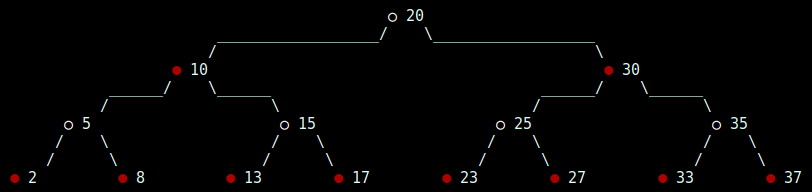

Not balanced binary search tree
===============================

Package rbtree provides an example of a Red-black search tree implementation.

It supports standard tree procedures, such as: inserting and deleting nodes,
finding nodes by given arbitrary key, finding the root, maximum and minimum
nodes, finding the predecessor and successor of a node.

-------------------------

## Features

It supports colored output of graphical representation of the tree using ASCII
graphics. For example, a tree with the keys `20, 10, 30, 5, 15, 25, 35, 8, 17,
37, 33, 13, 2, 23, 27` added sequentially will look like this:

-------------------------

## Feedback

Feel free to open the [issue] if you have any suggestions, comments or bug reports.

[issue]: https://github.com/r-che/algorithms/issues
